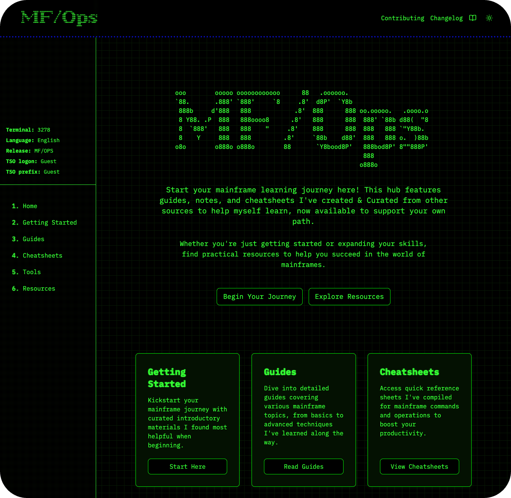

<h1 align="center">mainframeOps - Resource hub for mainframes & cloud operations.</h1>

  <a href="https://mainframeops.com">mainframeops.com</a> |
  <a href="https://mainframeops.com/contribute">contribute</a> |
  <a href="https://mainframeops.com/changelog">changelog</a>

<a href="https://www.mainframeops.com/">mainframeOps/mfops</a> is built to provide resources, guides, cheatsheets, and insights for working with mainframes and cloud technologies. This platform started as a way to document my learning journey in mainframes and cloud technologies as part of my final school project, where I aimed to combine my skills in cloud tech,mainframes, and modern web practices. Now, it aims to be a collaborative resource where others can contribute and new learners can easily navigate and benefit. 

This project is built with Next.JS and Typescript to ensure a scalable and performant user experience. It was deployed using AWS S3, CloudFront, and Route 53 and also features CI/CD pipeline implementation for streamlined deployments and continuous integration, ensuring updates and improvements are seamlessly pushed to production.

